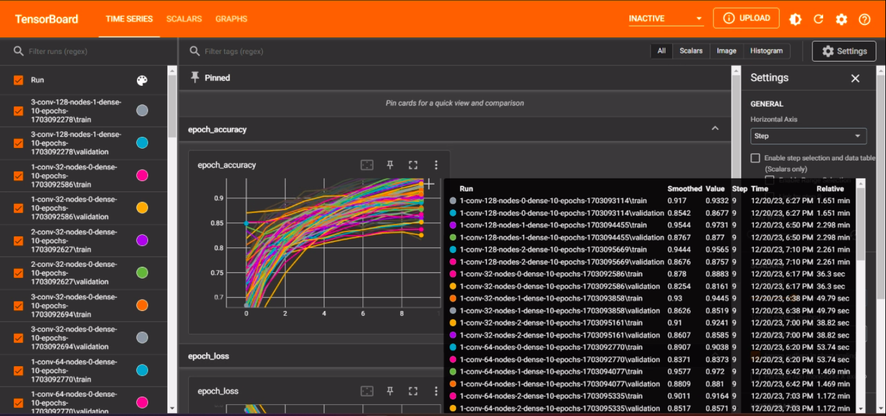

# D7041E - Face Mask Classifier using CNN

## Group 7

- **André Roaas**
  - Email: `androa-0@student.ltu.se`
- **Mohammed Shakir**
  - Email: `mohsha-0@student.ltu.se`

Dataset: https://www.kaggle.com/datasets/omkargurav/face-mask-dataset/

Demo: github.com/mohammed-shakir/FaceMaskClassifier

## Instructions

### Setting Up the Environment

1. **Install Dependencies**  
   Make sure to install the necessary requirements from the `requirements.txt` file.

   ```bash
   pip install -r requirements.txt
   ```
   
### Training the Model

1. Run `trainModel.py` to train the model:

2. Modify these arrays in `trainModel.py` to change layer configurations:
- `dense_layers = [1]` (Tested with 0, 1, 2)
- `layer_sizes = [128]` (Tested with 32, 64, 128)
- `conv_layers = [3]` (Tested with 1, 2, 3)
- `epochs = [10]` (Tested with 10, 20, 30, 50, 100)

### Testing the Model

1. Run `testModel.py` to test the model on the [`testImages`](./testImages).

## Evaluation



1. `1/1 [==============================] - 0s 110ms/step`  
   - File: without_mask_1.jpg  
   - Prediction: without_mask  
   - Actual: without_mask

2. `1/1 [==============================] - 0s 20ms/step`  
   - File: with_mask_8.jpg  
   - Prediction: without_mask  
   - Actual: with_mask

3. `1/1 [==============================] - 0s 19ms/step`  
   - File: with_mask_6.jpg  
   - Prediction: with_mask  
   - Actual: with_mask

4. `1/1 [==============================] - 0s 23ms/step`  
   - File: without_mask_7.jpg  
   - Prediction: without_mask  
   - Actual: without_mask

5. `1/1 [==============================] - 0s 19ms/step`  
   - File: without_mask_3.jpg  
   - Prediction: without_mask  
   - Actual: without_mask

6. `1/1 [==============================] - 0s 22ms/step`  
   - File: without_mask_10.jpg  
   - Prediction: without_mask  
   - Actual: without_mask

7. `1/1 [==============================] - 0s 18ms/step`  
   - File: with_mask_3.jpg  
   - Prediction: with_mask  
   - Actual: with_mask

8. `1/1 [==============================] - 0s 18ms/step`  
   - File: with_mask_5.jpg  
   - Prediction: with_mask  
   - Actual: with_mask

9. `1/1 [==============================] - 0s 19ms/step`  
   - File: without_mask_4.jpg  
   - Prediction: without_mask  
   - Actual: without_mask

10. `1/1 [==============================] - 0s 17ms/step`  
    - File: with_mask_1.jpg  
    - Prediction: with_mask  
    - Actual: with_mask

11. `1/1 [==============================] - 0s 20ms/step`  
    - File: without_mask_2.jpg  
    - Prediction: without_mask  
    - Actual: without_mask

12. `1/1 [==============================] - 0s 19ms/step`  
    - File: without_mask_6.jpg  
    - Prediction: without_mask  
    - Actual: without_mask

13. `1/1 [==============================] - 0s 17ms/step`  
    - File: without_mask_8.jpg  
    - Prediction: without_mask  
    - Actual: without_mask

14. `1/1 [==============================] - 0s 18ms/step`  
    - File: with_mask_10.jpg  
    - Prediction: with_mask  
    - Actual: with_mask

15. `1/1 [==============================] - 0s 19ms/step`  
    - File: with_mask_2.jpg  
    - Prediction: with_mask  
    - Actual: with_mask

16. `1/1 [==============================] - 0s 18ms/step`  
    - File: without_mask_5.jpg  
    - Prediction: without_mask  
    - Actual: without_mask

17. `1/1 [==============================] - 0s 22ms/step`  
    - File: with_mask_4.jpg  
    - Prediction: with_mask  
    - Actual: with_mask

18. `1/1 [==============================] - 0s 19ms/step`  
    - File: without_mask_9.jpg  
    - Prediction: without_mask  
    - Actual: without_mask

19. `1/1 [==============================] - 0s 18ms/step`  
    - File: without_mask_5.png  
    - Prediction: without_mask  
    - Actual: without_mask

20. `1/1 [==============================] - 0s 20ms/step`  
    - File: with_mask_7.jpg  
    - Prediction: with_mask  
    - Actual: with_mask

21. `1/1 [==============================] - 0s 17ms/step`  
    - File: with_mask_9.jpg  
    - Prediction: with_mask  
    - Actual: with_mask


### Model Evaluation:
- Correct Predictions: 20
- Incorrect Predictions: 1
- Accuracy: 0.95
